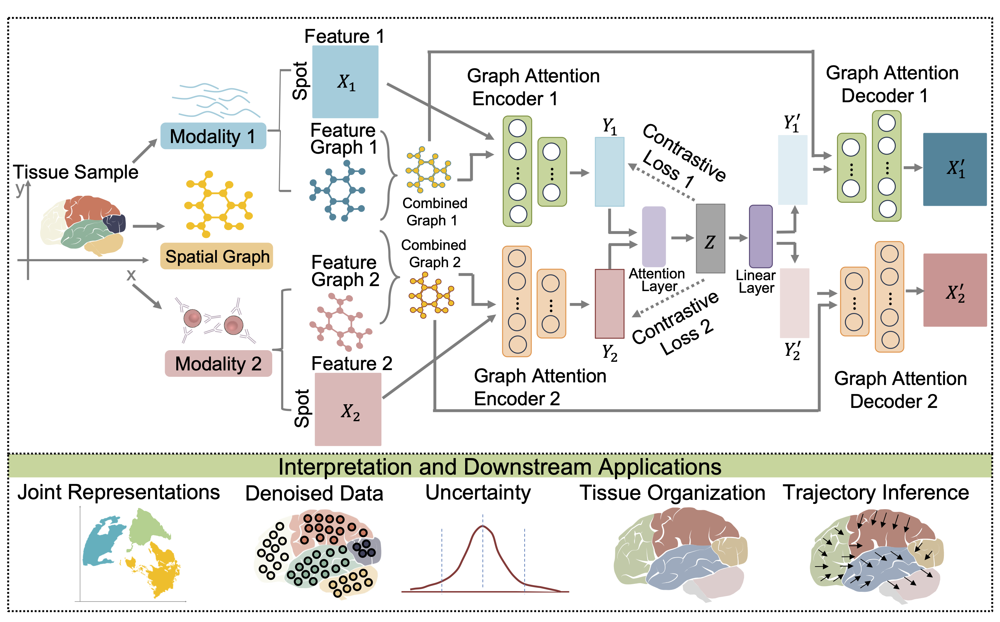

Welcome to SCIGMA's documentation!
===================================

.. SCIGMA tutorial docs file.

.. toctree::
   :maxdepth: 1
   :caption: Contents:

   Tutorial 1 Spatial ATAC-RNA-seq
   SCIGMA-10x-Xenium-Prime-Ovary
   SCIGMA-Spatial-Mux-Seq

Overview
========
Recent advances in spatial omics technologies have enabled simultaneous profiling of transcriptomic, proteomic, epigenomic, metabolomic, and imaging data at high spatial resolution, offering unprecedented opportunities to dissect tissue complexity. However, integrating these diverse and large-scale spatial multi-modal datasets remains a major computational challenge. We present SCIGMA, a scalable and generalizable deep learning framework for spatial multi-omics integration. SCIGMA introduces a novel uncertainty-aware contrastive learning objective and multi-view graph neural networks to preserve modality-specific signals while learning biologically meaningful joint representations. Unlike existing methods, SCIGMA provides spatially resolved uncertainty estimates, improving interpretability and identifying regions of biological or technical heterogeneity. SCIGMA is the first spatial multi-omics method to support integration of up to five modalities—as demonstrated on Spatial-Mux-Seq data—and its modular framework is extensible to future technologies with even more modalities. It also scales to over one million spatial locations, enabling analysis of ultra-high-resolution datasets such as VisiumHD and Xenium Prime. 
